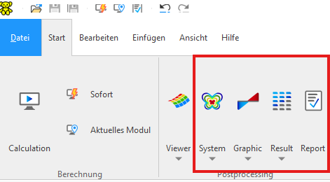

# Pre-processing: Teddy

The shown example were prepared using the SOFiSTiK CADINP Language (textual input, not graphical user interface) and the coresponding Files can be opened using the Software `TEDDY` (2025 or whichever Version is installed). 

`Teddy` stands for Textual Editor, the files provided are text files (UTF-8) and can be opened in any text editor, howevere Teddy has in integrated synthax highlighter for easier reading and can directly execute the code and the different post-processing modules (Grafix, Results viewer, Report etc.). 

CADINP language can be also used in the SSD (SOFiSTiK Structural Desktop) if a Text Editor Task is inserted.

# Post-processing 

Post-processing is done via:
- System: visualisation of the FE-Model
- Graphic: plot of graphical results
- Result: plot of results in table format
- Report: report viewer

The tools can be executed in Teddy, top left corner:

# Additional

## YouTube - SOFiSTiK Text Editor

There are a few videos on the topic of SOFiSTiK Text Editor possibilities, available here:

[YouTube - SOFiSTiK Text Editor](https://www.youtube.com/playlist?list=PL9q55sE0H9uPNl6kPXqu23LEmiqTVCsrQ)

