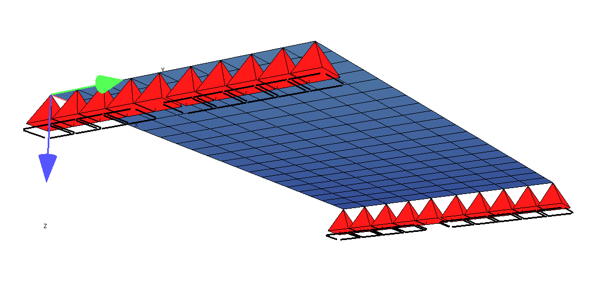
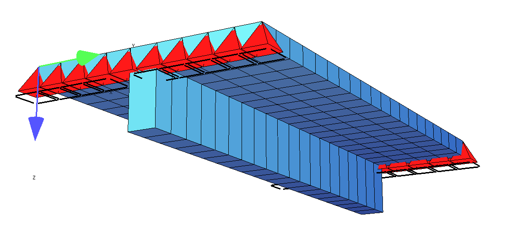
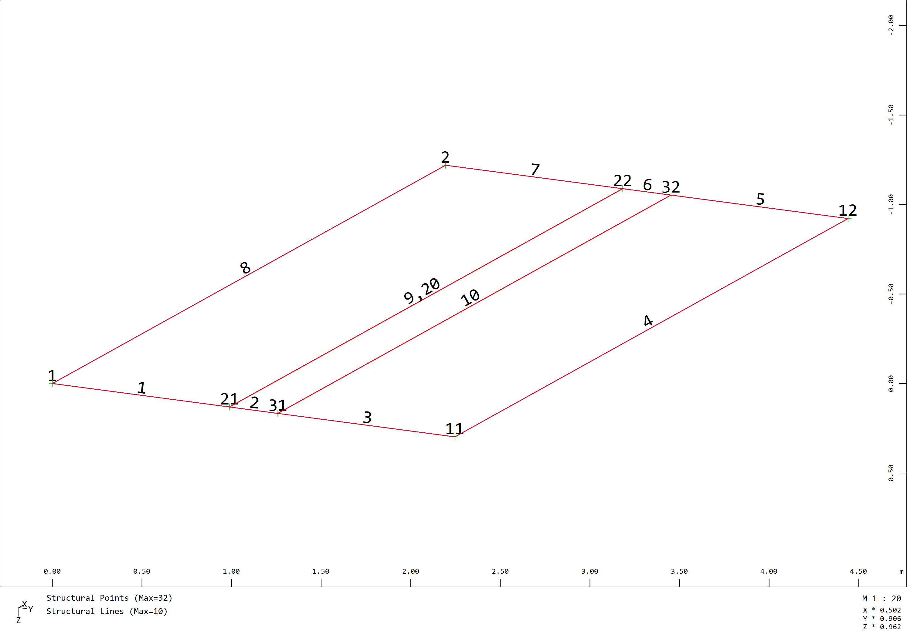
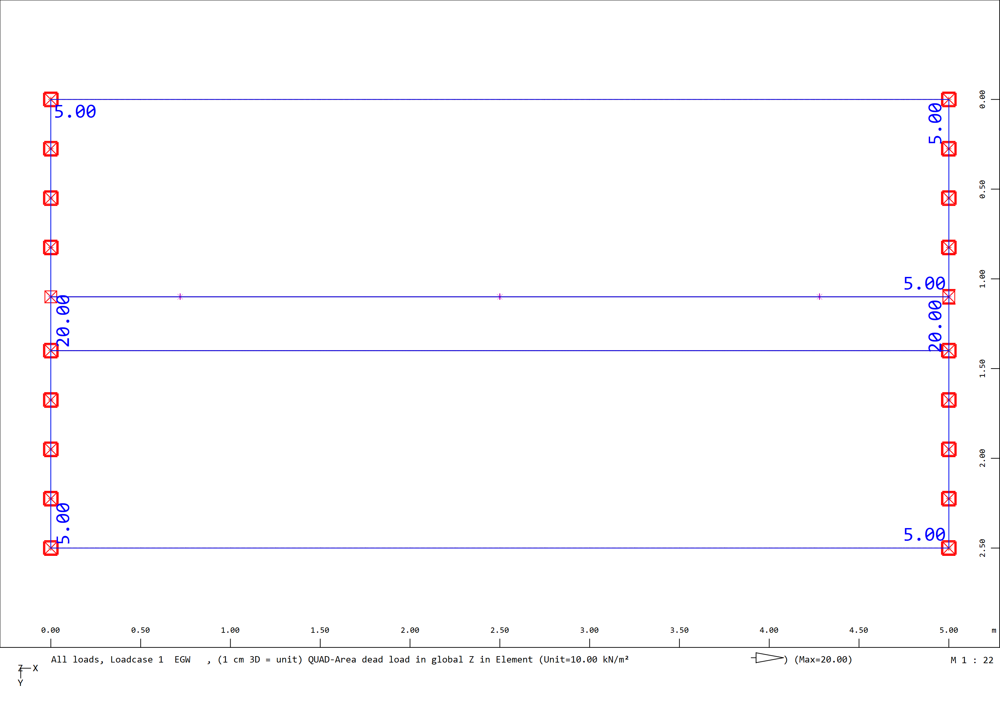
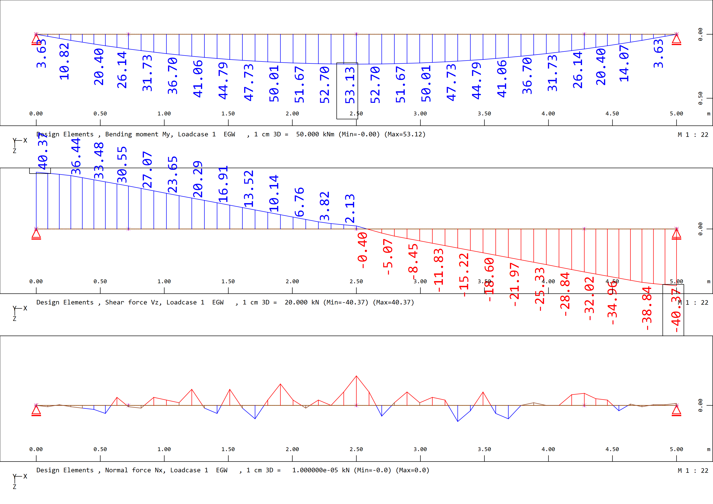

# T-Beam Quad Elements

## General

Used finite elements:
- Quad Elements

Visualisation of the FE-Modell without thickness of the quad elements:


Visualisation of the FE-Modell with thickness of the quad elements:


## Download File

The Sofistik Teddy File can be downloaded here:
[T-Beam Example Quad Elements](https://github.com/AIztok/Modelling-Analysis_Structural_Concrete/blob/main/SOFiSTiK_Files/02_T-beam/T-beam_Example-Quad_elements.dat)
## What does the Software do?

The software performs in the background the following operations:

- the internal forces of the quad elements are calculated,
- in the `DECREATOR` module the T-Beam cross section is referenced and the structural line embedded in the quad elements and based on the specified plate width (`BO`) the plate internal forces are integrated,
- alternatively a design would be possible only with the Quad elements, no integration to beam forces needed.

## Materials

Teddy Input for defining the materials:

```
+prog aqua
head 'Materials'
$----------------------------------------------------------------------------------
!*! Specification of the standard
NORM OEN en199X-200X unit 0 !
$----------------------------------------------------------------------------------
!*! Scope of output
echo full extr
$----------------------------------------------------------------------------------
!*! Concrete
CONC NO 1  TYPE c 30N           titl 'Conc. C30/37'
$----------------------------------------------------------------------------------
!*! Reinforcement
STEE NO 101 TYPE b 550b titl 'Reinf. B550B'

end 
```
## Cross sections

Teddy Input for defining the cross section of the beam elements:

```
+prog aqua
head 'Cross sections'
$----------------------------------------------------------------------------------
!*! Units for input and output (i = input; o = output)
page unii 0 unio 0

$----------------------------------------------------------------------------------
!*! Control
ctrl rest 2 ! Control to ensure the specifications of the previous AQUA are not overwritten

$----------------------------------------------------------------------------------
!*! Cross-section T-Beam - used for design element (module Decreator)
SREC 2 H 0.8 B 0.3 HO 0.2 BO 2.5 MNO 1 MRF 101 SO 0.04[m] titl 'T-beam simple'

end 
```

## System

Input of the static system for the automatic meshing using the `SOFiMSHC` Module.

In the Figure below the Structural Node and Structural Line Numbers are shown:


SOFiMSHC Code Block:

```
+prog sofimshc
head 'Model'
$----------------------------------------------------------------------------------
!*! System und Netzparameter
ctrl mesh 2 $ 1 - Stabmodell, 2 - Flächenmodell, 3 - Volumenmodell
ctrl hmin 0.25 $[m] Größe Finite Elemente

syst 3D gdir posz gdiv 10000
$ gdir: globales Koordinaten System. Posz = Z Richtung nach unten
$ gdiv: Gruppendivisor = wie viele finite Elemente in einer Gruppe (Bei 100 sind die Elemente der Gruppe 1: 101, 102 bis 199 möglich)


$----------------------------------------------------------------------------------
!*! Strukturpunkte
spt no  x       y           z               fix
    1   0       0           0               -
    11  0       2.5         0               -
    2   5       0           0               -
    12  5       2.5         0               -
    21  0       1.25-0.3/2  0               pp
    22  5       1.25-0.3/2  0               py
    31  0       1.25+0.3/2  0               -
    32  5       1.25+0.3/2  0               -

$----------------------------------------------------------------------------------
!*! Strukturlinien
sln 1   1   21  fix pz
sln 2   21  31  fix pz
sln 3   31  11  fix pz
sln 4   11  12
sln 5   12  32  fix pz
sln 6   32  22  fix pz
sln 7   22  2   fix pz
sln 8   2   1
sln 9   21  22
sln 10  31  32

$ Line for the design beam - see decreator below
sln 20 21 22

$----------------------------------------------------------------------------------
!*! Strukturflächen
$ Platte
sar 1 grp 1 mno 1 mrf 101 t 0.20[m] qref belo mctl regm
    sarb out nl 1,9,7,8
sar 2 grp 1 mno 1 mrf 101 t 0.80[m] qref belo mctl regm
    sarb out nl 2,10,6,9
sar 3 grp 1 mno 1 mrf 101 t 0.20[m] qref belo mctl regm
    sarb out nl 3,4,5,10

! Important:
!       - the quads must be defined with "qref belo" to simulate a t-beam (correct stiffness)
    
```

## Actions / Loads

As no combinations acc. Standards are created, only the loads with no assignment to actions are defined:

```
+prog sofiload
head 'Lasten'

$ Deadload
lc 1 facd 1.0 titl 'DL'
$ Additional permanent load
lc 2 titl '5kN/m2'
    quad grp 1 type pg p 5

end    
```

Dead Load of the 80 cm thick quad:
G<sub>beam</sub> = 1m x 0,8m x 25kN/m<sup>3</sup> = 20kN/m 



## Linear calculation

Linear calculation is performed as following, here both load cases are calculated separately and once a load combination is created within ASE Module:

```
+prog ase
head 'Berechnung'
$----------------------------------------------------------------------------------
!*! Scope of output
echo full extr
page lano 0 $ Output in German / 1 English

$----------------------------------------------------------------------------------
!*! Analysis parameters
syst prob line $ linear analysis

$----------------------------------------------------------------------------------
!*! Element groups
grp - $ activate all element groups

$----------------------------------------------------------------------------------
!*! Load cases
lc all $ calculate all load cases defined in SOFiLOAD

$ Example direct load combination in ASE
lc 201 facd 1.35 $ Self-weight cannot be copied; it must be defined explicitly in ASE if used with other copied loadcases (lcc)
lcc 2 fact 1.35 $ Load case 2 is copied and factored

end  
```

## Integration plate internal forces

SOFiSTiK has two modules for integration of beam / plate / volume Finite Elements:
- SIR
- DECREATOR

SIR is a general (older) module for integration of internal forces.
`DECREATOR` is a more specialized module to define design elements / beams and the integration is performed to determine the beam forces.

Here `DECREATOR` will be used:

```
+prog decreator
head 'Integration'

echo dsln full
echo forc full

dsln no 1 ncs 2 fref sc hdiv 0.1
 dgeo sln 20
 dslc ref strt,end 0.0 typm hfac
 dslc ref strt,end 0.9*0.8 typm shea
 dslc ref mid typm sect
 dsel box

lc all

end  
```

## Results and Discussion

The results can be shown using `Graphic`, below the code block is given to generate the shown plots directly from `TEDDY`.

Using the `Decreator` it integrates the plate internal forces (based on the `Bo` of the T-Beam cross section in `AQUA`):
- Bending moment M<sub>y</sub>
- Shear forces V<sub>z</sub>
- Normal force N (should be zero)

```
+PROG WING
HEAD 'Results Design beam'

SIZE TYPE URS SC 0 MARG NO SPLI '3*1'

VIEW TYPE DIRE X 0 Y -1 Z 0 AXIS POSZ ROTA 0

DSGN TYPE LINE DTYP DEFA
BEAM TYPE DSGN ROPT P STAT ALL STAL ALL OFFZ MIDD

LC   NO 1 ; BEAM TYPE MY UNIT DEFA SCHH 0.5 STYP DSLN FILL NO REPR DLIN
LC   NO 1 ; BEAM TYPE VZ UNIT DEFA SCHH 0.5 STYP DSLN FILL NO REPR DLIN
LC   NO 1 ; BEAM TYPE N UNIT DEFA SCHH 0.5 STYP DSLN FILL NO REPR DLIN

END 
```



## Special cases 

/

## Pros & Cons

The pros of this approach are:
- clear finite element model, as no double stiffnesses or masses which need to be substracted 
- the results can be used directly to design the quad elements
- the model can be used also for prestressed concrete
- in case of nonlinear material analysis the Quad elements enable additional options compared to beam elements

The cons of this approach are:
- in case that internal beam forces are required an integration is necessary
- in cases where slab is wider as the T-beam b<sub>eff</sub>  the normal force in the beam will not be zero as the shear lag effect doesn't correspond to the EN 1992-1-1 calculation


