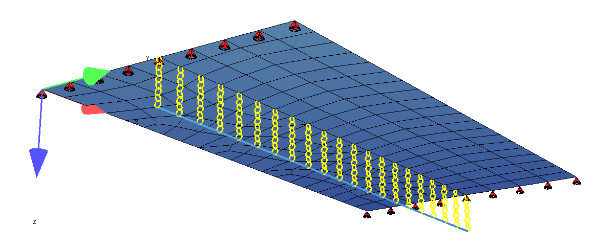
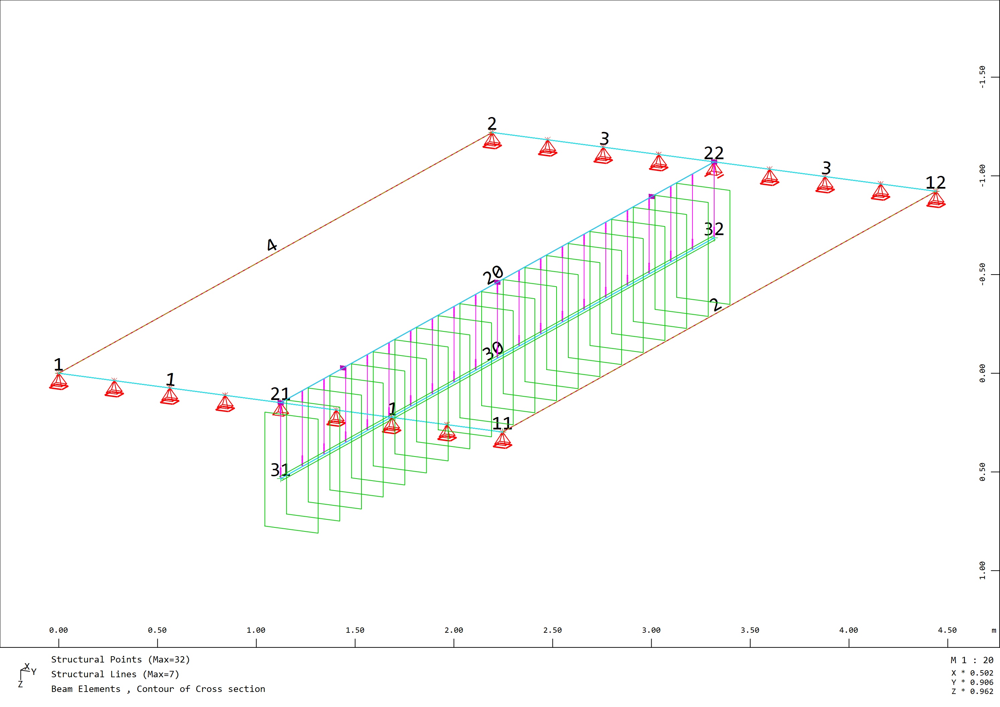
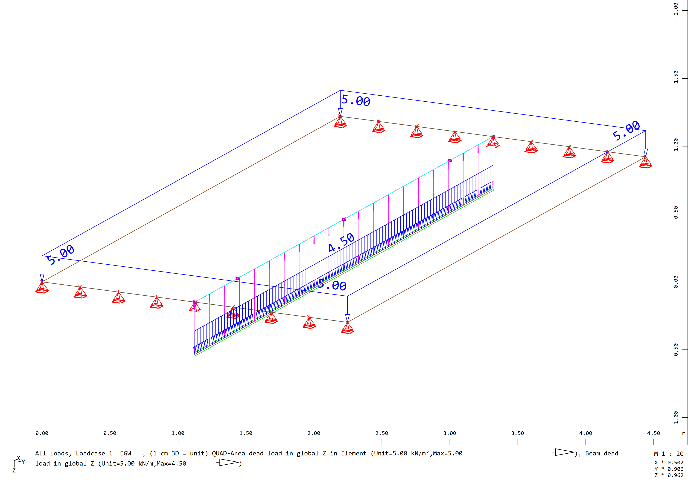
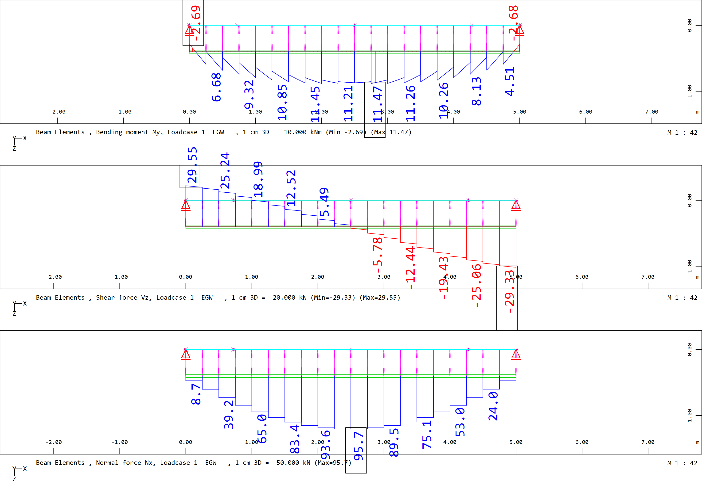
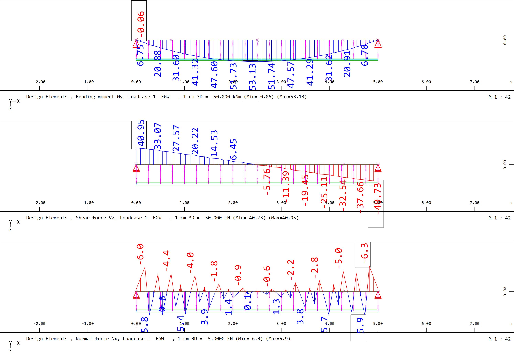

## Table of content

[General](#General)

[Download File](#Download%20File)

[What does the Software do?](#What%20does%20the%20Software%20do?)

[Materials](#Materials)

[Cross sections](#Cross%20sections)

[System](#System)

[Actions / Loads](#Actions%20/%20Loads)

[Linear calculation](#Linear%20calculation)

[Integration plate internal forces](#Integration%20plate%20internal%20forces)

[Results and Discussion](#Results%20and%20discussion)

[Special cases](#Special%20cases)

[Pros & Cons](#Pros%20&%20Cons)

## General

Used finite elements:
- Beam Element with rectangular cross section
- Quad Elements

Plate (Quad) elements with excentricly coupled beam:


## Download File

The Sofistik Teddy File can be downloaded here:
[T-Beam Example Centric Beam](https://github.com/AIztok/Modelling-Analysis_Structural_Concrete/blob/main/SOFiSTiK_Files/02_T-beam/T-beam_Example-Excentric_Beam.dat)

## What does the Software do?

The software performs in the background the following operations:

- the internal forces for the beam and quad elements are calculated with no substractions of the mass and stiffness,
- in the `DECREATOR` module the T-Beam cross section is referenced and the structural line embedded in the quad elements and based on the specified plate width (`BO`) the plate internal forces are integrated and summed with the beam.
 
## Materials

Teddy Input for defining the materials:

```
+prog aqua
head 'Materials'
$----------------------------------------------------------------------------------
!*! Specification of the standard
NORM OEN en199X-200X unit 0 !
$----------------------------------------------------------------------------------
!*! Scope of output
echo full extr
$----------------------------------------------------------------------------------
!*! Concrete
CONC NO 1  TYPE c 30N           titl 'Conc. C30/37'
$----------------------------------------------------------------------------------
!*! Reinforcement
STEE NO 101 TYPE b 550b titl 'Reinf. B550B'

end 
```
## Cross sections

Teddy Input for defining the cross section of the beam elements:

```
+prog aqua
head 'Cross sections'
$----------------------------------------------------------------------------------
!*! Units for input and output (i = input; o = output)
page unii 0 unio 0

$----------------------------------------------------------------------------------
!*! Control
ctrl rest 2 ! Control to ensure the specifications of the previous AQUA are not overwritten

$----------------------------------------------------------------------------------
!*! Cross-section on rectangle - used in the FE-Model
SREC 1 H 0.8-0.2 B 0.3 MNO 1 MRF 101 SO 0.04[m] titl 'B/H=30/60cm'

!*! Cross-section T-Beam - used for design element (module Decreator)
SREC 2 H 0.8 B 0.3 HO 0.2 BO 2.5 MNO 1 MRF 101 SO 0.04[m] titl 'T-beam simple'

end 
```

## System

Input of the static system for the automatic meshing using the `SOFiMSHC` Module.

In the Figure below the Structural Node and Structural Line Numbers are shown:




SOFiMSHC Code Block:

```
+prog sofimshc
head 'Model'
$----------------------------------------------------------------------------------
!*! System and mesh parameters
ctrl mesh 2 $ 1 - bar model, 2 - surface model, 3 - solid model
ctrl hmin 0.25 $[m] Size of finite elements

syst 3D gdir posz gdiv 10000
$ gdir: global coordinate system. posz = Z-direction downward
$ gdiv: group divisor = how many finite elements in a group (with 100, the elements of group 1 can be: 101, 102 up to 199)

$----------------------------------------------------------------------------------
!*! Structural points
spt no  x       y       z               fix
    1   0       0       0               -
    11  0       2.5     0               -
    2   5       0       0               -
    12  5       2.5     0               -
    21  0       1.25    0               pp
    22  5       1.25    0               py
    31  0       1.25    0.2/2+0.6/2     -
    32  5       1.25    0.2/2+0.6/2     -

$----------------------------------------------------------------------------------
!*! Structural lines
$ Outline of the slab
sln 1 1  11 fix pz
sln 2 11 12
sln 3 12 2  fix pz
sln 4 2  1
$ Beam
sln 20 21 22
sln 30 31 32 sno 1 grp 3
    slns 3 fix kf reft >sln ref 20 $ fix coupling of the beam with the slab

$----------------------------------------------------------------------------------
!*! Structural areas
$ Slab
sar 1 grp 1 mno 1 mrf 101 t 0.2[m] qref cent mctl regm
    sarb out nl 1,2,3,4

end   
```


## Actions / Loads

As no combinations acc. Standards are created, only the loads with no assignment to actions are defined:

```
+prog sofiload
head 'Lasten'

$ Deadload
lc 1 facd 1.0 titl 'EGW'
$ Additional permanent load
lc 2 titl '5kN/m2'
    quad grp 1 type pg p 5

end    
```


G<sub>beam</sub> = 0,6m x 0,3m x 25kN/m<sup>3</sup> = 4,5kN/m 



## Linear calculation

Linear calculation is performed as following, here both load cases are calculated separately and once a load combination is created within ASE Module:

```
+prog ase
head 'Berechnung'
$----------------------------------------------------------------------------------
!*! Scope of output
echo full extr
page lano 0 $ Output in German / 1 English

$----------------------------------------------------------------------------------
!*! Analysis parameters
syst prob line $ linear analysis

$----------------------------------------------------------------------------------
!*! Element groups
grp - $ activate all element groups

$----------------------------------------------------------------------------------
!*! Load cases
lc all $ calculate all load cases defined in SOFiLOAD

$ Example direct load combination in ASE
lc 201 facd 1.35 $ Self-weight cannot be copied; it must be defined explicitly in ASE if used with other copied loadcases (lcc)
lcc 2 fact 1.35 $ Load case 2 is copied and factored

end  
```

## Integration plate internal forces

SOFiSTiK has two modules for integration of beam / plate / volume Finite Elements:
- SIR
- DECREATOR

SIR is a general (older) module for integration of internal forces.
`DECREATOR` is a more specialized module to define design elements / beams and the integration is performed to determine the beam forces.

Here `DECREATOR` will be used:

```
+prog decreator
head 'Integration'

echo dsln full
echo forc full

dsln no 1 ncs 2 fref sc hdiv 0.1
 dgeo sln 20
 dslc ref strt,end 0.0 typm hfac
 dslc ref strt,end 0.9*0.8 typm shea
 dslc ref mid typm sect
 dsel box

lc all

end  
```

## Results and Discussion

The results can be shown using `Graphic`, below the code block is given to generate the shown plots directly from `TEDDY`.

Internal forces of the rectangular beam ( (LC 1 - Dead load)) - it is visible, that the load is mainly sustained by tension (beam) - compression (plate) duo as the axial stiffness is much larger as the bending stiffness:
- Bending moment M<sub>y</sub>
- Shear forces V<sub>z</sub>
- Normal force N (should be zero)

```
+PROG WING
HEAD 'Results beam'

SIZE TYPE URS SC 0 MARG NO SPLI '3*1'

VIEW TYPE DIRE X 0 Y -1 Z 0 AXIS POSZ ROTA 0

DSGN TYPE LINE DTYP DEFA
BEAM TYPE DSGN ROPT P STAT ALL STAL ALL OFFZ MIDD

LC   NO 1 ; BEAM TYPE MY UNIT DEFA SCHH 0.5 STYP BEAM FILL NO REPR DLIN
LC   NO 1 ; BEAM TYPE VZ UNIT DEFA SCHH 0.5 STYP BEAM FILL NO REPR DLIN
LC   NO 1 ; BEAM TYPE N UNIT DEFA SCHH 0.5 STYP BEAM FILL NO REPR DLIN

END 
```



Using the `Decreator` it integrates the plate internal forces (based on the `Bo` of the T-Beam cross section in `AQUA`):
- Bending moment M<sub>y</sub>
- Shear forces V<sub>z</sub>
- Normal force N (should be zero)

```
+PROG WING
HEAD 'Results Design beam'

SIZE TYPE URS SC 0 MARG NO SPLI '3*1'

VIEW TYPE DIRE X 0 Y -1 Z 0 AXIS POSZ ROTA 0

DSGN TYPE LINE DTYP DEFA
BEAM TYPE DSGN ROPT P STAT ALL STAL ALL OFFZ MIDD

LC   NO 1 ; BEAM TYPE MY UNIT DEFA SCHH 0.5 STYP DSLN FILL NO REPR DLIN
LC   NO 1 ; BEAM TYPE VZ UNIT DEFA SCHH 0.5 STYP DSLN FILL NO REPR DLIN
LC   NO 1 ; BEAM TYPE N UNIT DEFA SCHH 0.5 STYP DSLN FILL NO REPR DLIN

END 
```



## Special cases 

/

## Pros & Cons

The pros of this approach are:
- clear finite element model, as no double stiffnesses or masses which need to be substracted 

The cons of this approach are:
- the internal forces can't be used directly for the design of the beam or slab elements. The slab internal forces need to be integrated together with the beam forces and the design needs to be performed on a separately defined T-Beam cross section


