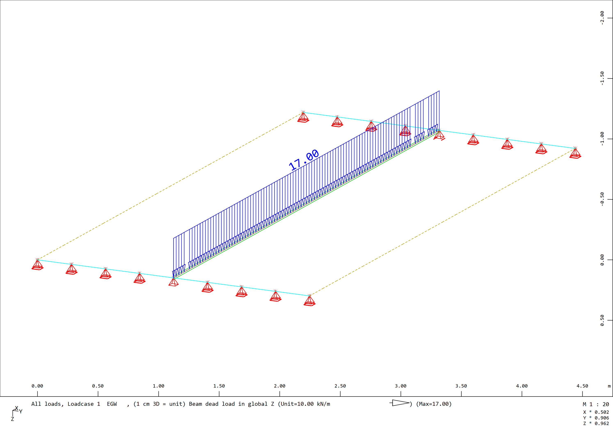

# T-Beam Orthotropic Slab

## General

This approach is commonly used in modeling structures where one direction is the main load bearing direction, such as bridges, where the main girders usually have a larger span and the function of the slab on top is to distribute the loads to those main girders.

Used finite elements:
- Beam Element with T-Beam cross section
- Quad Elements

Only beam elements visualized:


Only quad / plate elements visualized:


## Download File

The Sofistik Teddy File can be downloaded here:
[T-Beam Example Orthotropic Slab](https://github.com/AIztok/Modelling-Analysis_Structural_Concrete/blob/main/SOFiSTiK_Files/02_T-beam/T-beam_Example-Orthotropic_slab.dat)

## What does the Software do?

The software performs in the background the following operations:

- the axial and bending stiffness of the slab / quads in the direction of the beam is strongly reduced (to 0,1%),
- the internal plate an beam forces are calculated, as the slab has only a stiffness in cross direction, the loads are first transfered in cross direction to the beam and the beam transfers the loads to the supports,
- important is also to turn of the weight of the slab not to consider it twice by using a material with zero specific weight.
 
## Materials

Teddy Input for defining the materials:

```
+prog aqua
head 'Materials'
$----------------------------------------------------------------------------------
!*! Specification of the standard
NORM OEN en199X-200X unit 0 !
$----------------------------------------------------------------------------------
!*! Scope of output
echo full extr
$----------------------------------------------------------------------------------
!*! Concrete
CONC NO 1  TYPE c 30N           titl 'Conc. C30/37'
CONC NO 2  TYPE c 30N  gam 0    titl 'Conc. C30/37 Gam=0' ! weight of the plate zero

$----------------------------------------------------------------------------------
!*! Reinforcement
STEE NO 101 TYPE b 550b titl 'Reinf. B550B'
          
end 
```
## Cross sections

Teddy Input for defining the cross section of the beam elements:

```
+prog aqua
head 'Cross sections'
$----------------------------------------------------------------------------------
!*! Units for input and output (i = input; o = output)
page unii 0 unio 0

$----------------------------------------------------------------------------------
!*! Control
ctrl rest 2 ! Control to ensure the specifications of the previous AQUA are not overwritten

$----------------------------------------------------------------------------------
!*! T-beam - with polygon points
SECT NO  1  MNO  1 MRF 101 titl 'T-beam Poly'

let#h  0.80[m] ! Variable for cross section height
let#b  0.30[m] ! Variable for cross section width
let#ho 0.20[m] ! Variable for top flange thickness
let#bo 2.50[m] ! Variable for top flange width

!*! Stress points - where the stresses will be calculated
$ Top edge
SPT OKL  Y -#bo/2 Z  0 MNO 1
SPT OKM  Y  0.00  Z  0 MNO 1
SPT OKR  Y +#bo/2 Z  0 MNO 1
$ Bottom edge
SPT UKL  Y -#b/2  Z #H MNO 1
SPT UK   Y  0.00  Z #H MNO 1
SPT UKR  Y +#b/2  Z #H MNO 1
$ Polygon points
POLY TYPE O   MNO  1
    VERT   1  Y    0     Z   0       REFP OKL
    VERT   2  Y    0     Z   0       REFP OKM
    VERT   3  Y    0     Z   0       REFP OKR
    VERT   4  Y    0     Z   #ho     REFP OKR
    VERT   5  Y  #b/2    Z   #ho     REFP OKM
    VERT  11  Y    0     Z   0       REFP UKR
    VERT  12  Y    0     Z   0       REFP UK
    VERT  13  Y    0     Z   0       REFP UKL
    VERT  15  Y -#b/2    Z   #ho     REFP OKM
    VERT  14  Y    0     Z   #ho     REFP OKL

! Shear cuts
CUT 'Csc' ZB 'S' ! shear cut through the centre of gravity
CUT 'Web' ZB #ho+0.01 ! shear cut below the slab
CUT 'Fla' YB #b/2+0.01 ZB +0.5 REFA 2 YE #b/2+0.01 ZE -0.05 REFE 2
         
end 
```

## System

Input of the static system for the automatic meshing using the `SOFiMSHC` Module.

In the Figure below the Structural Node and Structural Line Numbers are shown:


SOFiMSHC Code Block:

```
+prog sofimshc
head 'Model'
$----------------------------------------------------------------------------------
!*! System and mesh parameters
ctrl mesh 2 $ 1 - bar model, 2 - surface model, 3 - solid model
ctrl hmin 0.25 $[m] Size of finite elements

syst 3D gdir posz gdiv 10000
$ gdir: global coordinate system. posz = Z-direction downward
$ gdiv: group divisor = how many finite elements in a group (with 100, the elements of group 1 can be: 101, 102 up to 199)

$----------------------------------------------------------------------------------
!*! Structural points
spt no  x       y       z               fix
    1   0       0       0               -
    11  0       2.5     0               -
    2   5       0       0               -
    12  5       2.5     0               -
    21  0       1.25    0               pp
    22  5       1.25    0               py
    31  0       1.25    0.1/2+0.2/2     -
    32  5       1.25    0.1/2+0.2/2     -

$----------------------------------------------------------------------------------
!*! Structural lines
sln 1 1  11 fix pz
sln 2 11 12
sln 3 12 2  fix pz
sln 4 2  1
$ Beam
sln 20 21 22 sno 1 grp 1

$----------------------------------------------------------------------------------
!*! Structural areas
$ Slab
sar 1 grp 2 mno 2 mrf 101 t 0.20[m] qref belo mctl regm drx 1 0 0
    sarb out nl 1,2,3,4

! Important:
!       - the plate/quads should be defined with a differenz group number as beams to adress the mexplicitly in ase (reduction of stiffness)
!       - the local x axis must correspond with the beam direction - can be rotated by using drx/dry/drz
       
end   
```


## Actions / Loads

As no combinations acc. Standards are created, only the loads with no assignment to actions are defined:

```
+prog sofiload
head 'Lasten'

$ Deadload
lc 1 facd 1.0 titl 'EGW'
$ Additional permanent load
lc 2 titl '5kN/m2'
    quad grp 2 type pg p 5

end    
```


Only the T-Beam has a weight:



## Linear calculation

Linear calculation is performed as following, here both load cases are calculated separately and once a load combination is created within ASE Module:

```
+prog ase
head 'Calculation'
$----------------------------------------------------------------------------------
!*! Scope of output
echo full extr
page lano 1 $ Output in 0 = German / 1 = English

$----------------------------------------------------------------------------------
!*! Analysis parameters
syst prob line $ linear analysis

$----------------------------------------------------------------------------------
!*! Element groups
grp - $ activate all element groups
grp2 2 quex 0.001 qemx 0.001 $ reduce the axial and bending stiffness of the slab in local x direction

$----------------------------------------------------------------------------------
!*! Load cases
lc all $ calculate all load cases defined in SOFiLOAD

$ Example direct load combination in ASE
lc 201 facd 1.35 $ Self-weight cannot be copied; it must be defined explicitly in ASE if used with other copied loadcases (lcc)
lcc 2 fact 1.35 $ Load case 2 is copied and factored
     
end  
```

## Results and Discussion

The results can be shown using `Graphic`, below the code block is given to generate the shown plots directly from `TEDDY`.

Internal forces of the T-beam:
- Bending moment M<sub>y</sub>
- Shear forces V<sub>z</sub>
- Normal force N (should be zero)

```
+PROG WING
HEAD 'Results beam'

SIZE TYPE URS SC 0 MARG NO SPLI '3*1'

VIEW TYPE DIRE X 0 Y -1 Z 0 AXIS POSZ ROTA 0

DSGN TYPE LINE DTYP DEFA
BEAM TYPE DSGN ROPT P STAT ALL STAL ALL OFFZ MIDD

LC   NO 1 ; BEAM TYPE MY UNIT DEFA SCHH 0.5 STYP BEAM FILL NO REPR DLIN
LC   NO 1 ; BEAM TYPE VZ UNIT DEFA SCHH 0.5 STYP BEAM FILL NO REPR DLIN
LC   NO 1 ; BEAM TYPE N UNIT DEFA SCHH 0.5 STYP BEAM FILL NO REPR DLIN

END 
```


## Special cases 

/

## Pros & Cons

The pros of this approach are:
- clear load bearing path
- simple design of the main girders, as the calculated internal forces can be used directly for the cross section design

The cons of this approach are:
- If the same model is used to design also the orthotopic concrete slab, the results are conservative, as the loads, such as axle loads of vehicles are which results in larger bending moments and shear forces. Therefore, often for the design in cross direction the same model is used, but with the slabs full stiffness in both direction and the bending stiffness of the main girders increase (e.g. by a factor 100) and only the slab is designed.
- For skewed bridges this approach is not suitable.


