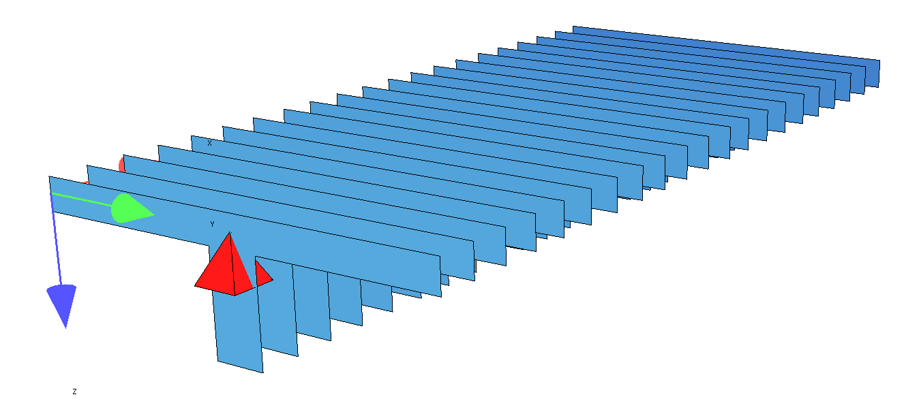
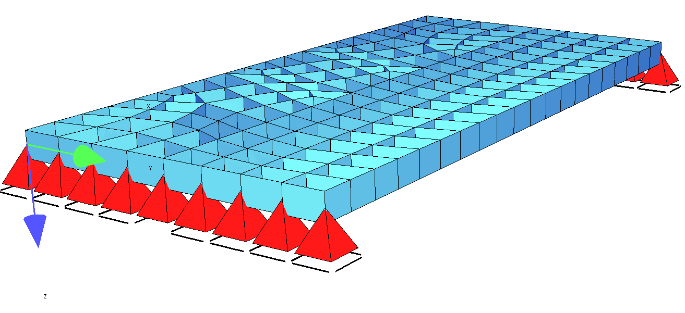
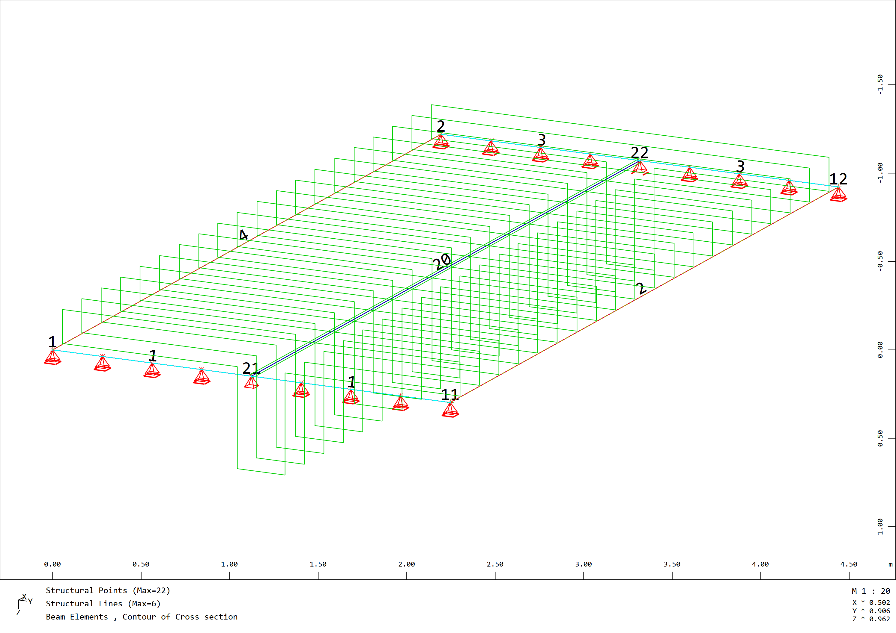

## Table-of-content

[General](#General)

[Additional Material](#Additional-Material)

[Approach 1: Centric Beam](#Approach-1-Centric-beam)

[Approach 2.1: Excentric Beam](#Approach-2.1-Excentric-beam)

[Approach 2.2: Only Quad Elements](#Approach-2.2-Only-Quad-Elements)

[Approach 3: Orthotropic slab](#Approach-3-Orthotropic-slab)

[Approach 4: Correction beam](#Approach-4-Correction-beam)

## General

Possible modeling approaches for T-Beam will be shown:
- Approach 1: centric beam
- Approach 2.1: excentric beam
- Approach 2.2: Only quad elements no beams
- Approach 3: Orthotropic slab with beams
- Approach 4: Correction beam with slab, beam and correction beam (negative stiffness)

## Approach-1-Centric-beam

This approach represents the typical case in modeling of T-Beams in Buildings.

Used finite elements:
- Beam Element with T-Beam cross section
- Quad Elements

Only beam elements visualized:


Only quad / plate elements visualized:


### Download File

The Sofistik Teddy File can be downloaded here:
[T-Beam Example Centric Beam](https://github.com/AIztok/Modelling-Analysis_Structural_Concrete/blob/main/SOFiSTiK_Files/02_T-beam/T-beam_Example-Centric_Beam.dat)


### What does the Software do?

The software performs in the background the following operations:

- the bending and shear stiffness of the plate for the given `HO` and `BO` in the cross section (Aqua Module) is calculated and substrcted from the bending / shear stiffness of the beam to prevent double stiffness in the system

- the same ist done with the weight, which is for the plate considered only once

- the internal forces of the plate / quad elements at the intersecting point with the beam element are read and multiplied with the width `BO` and added to the results of the beam elements

- The bending and shear design can be later performed directly on the beam element with the automatically summed internal forces for the T-beam

- The required plate reinforcement in the direction of the beam  in the width `BO` can be neglected - the design module (Bemess) doesn't consider, that the plate internal forces are already covered by the T-Beam

### Materials

Teddy Input for defining the materials:

```
+prog aqua
head 'Materials'
$----------------------------------------------------------------------------------
!*! Specification of the standard
NORM OEN en199X-200X unit 0 !
$----------------------------------------------------------------------------------
!*! Scope of output
echo full extr
$----------------------------------------------------------------------------------
!*! Concrete
CONC NO 1  TYPE c 30N           titl 'Conc. C30/37'
$----------------------------------------------------------------------------------
!*! Reinforcement
STEE NO 101 TYPE b 550b titl 'Reinf. B550B'

end 
```
### Cross sections

Teddy Input for defining the cross section of the beam elements:

```
+prog aqua
head 'Cross sections'
$----------------------------------------------------------------------------------
!*! Units for input and output (i = input; o = output)
page unii 0 unio 0

$----------------------------------------------------------------------------------
!*! Control
ctrl rest 2 ! Control to ensure the specifications of the previous AQUA are not overwritten

$----------------------------------------------------------------------------------
!*! Cross-section slab beam - "CENTRIC SLAB BEAM"
SREC 1 H 0.8 B 0.3 HO 0.2 BO 2.5 MNO 1 MRF 101 SO 0.04[m] titl 'T-beam simple'

end   
```

### System

Input of the static system for the automatic meshing using the SOFiMSHA Module.

In the Figure below the Structural Node and Structural Line Numbers are shown:



SOFiMSHC Code Block:

```
+prog sofimshc
head 'Model'
$----------------------------------------------------------------------------------
!*! System and mesh parameters
ctrl mesh 2 $ 1 - bar model, 2 - surface model, 3 - solid model
ctrl hmin 0.25 $[m] Size of finite elements

syst 3D gdir posz gdiv 10000
$ gdir: global coordinate system. posz = Z-direction downward
$ gdiv: group divisor = how many finite elements in a group (with 100, the elements of group 1 can be: 101, 102 up to 199)

$----------------------------------------------------------------------------------
!*! Structural points
spt no  x       y       z               fix
    1   0       0       0               -
    11  0       2.5     0               -
    2   5       0       0               -
    12  5       2.5     0               -
    21  0       1.25    0               pp
    22  5       1.25    0               py
    31  0       1.25    0.1/2+0.2/2     -
    32  5       1.25    0.1/2+0.2/2     -

$----------------------------------------------------------------------------------
!*! Structural lines
$ Outline of the slab
sln 1 1  11 fix pz
sln 2 11 12
sln 3 12 2  fix pz
sln 4 2  1
$ Beams
sln 20 21 22 sno 1 grp 1

$----------------------------------------------------------------------------------
!*! Structural areas
$ Slab
sar 1 grp 1 mno 1 mrf 101 t 0.2[m] qref cent mctl regm
    sarb out nl 1,2,3,4
! IMPORTANT: For centric slab beams:
!       - Slab thickness (t) must be equal to HO in SREC in AQUA)
!       - Slabs must be defined centric (qref cent) so that the centroid axes of beam and slab coincide

end   
```


### Actions / Loads

As no combinations acc. Standards are created, only the loads with no assignment to actions are defined:

```
+prog sofiload
head 'Lasten'

$ Deadload
lc 1 facd 1.0 titl 'EGW'
$ Additional permanent load
lc 2 titl '5kN/m2'
    quad grp 1 type pg p 5

end    
```

As visible in the visaulisation of the applied dead load (self weight) the double area of the plate was already substracted from the beam dead load:

G<sub>beam</sub> = 0,6m x 0,3m x 25kN/m<sup>3</sup> = 4,5kN/m 

![[T-Beam_DL.png]]

### Linear calculation

Linear calculation is performed as following, here both load cases are calculated separately and once a load combination is created within ASE Module:

```
+prog ase urs:4
head 'Berechnung'
$----------------------------------------------------------------------------------
!*! Scope of output
echo full extr
page lano 0 $ Output in German / 1 English

$----------------------------------------------------------------------------------
!*! Analysis parameters
syst prob line $ linear analysis

$----------------------------------------------------------------------------------
!*! Element groups
grp - $ activate all element groups

$----------------------------------------------------------------------------------
!*! Load cases
lc all $ calculate all load cases defined in SOFiLOAD

$ Example direct load combination in ASE
lc 201 facd 1.35 $ Self-weight cannot be copied; it must be defined explicitly in ASE if used with other copied loadcases (lcc)
lcc 2 fact 1.35 $ Load case 2 is copied and factored

end  
```

### Results and Discussion


Internal Forces of the T-Beam from dead load (Load case 1), which include already the integrated plate internal forces:
- Bending moment M<sub>y</sub>
- Shear forces V<sub>z</sub>
- Normal force N (should be zero)

![[T-Beam_Approach-1_Internal-forces.png]]

The numerical results of the addition plate and beam forces can be checked in the `Report`, here for the maximum value in the middle of the span:
![[T-Beam_Approach-1_Table.png]]


### Special case of T-beams on the Edges of Slabs

An important case are Edgebeams, which are located on the edge of the slab.

**To be added**

### Pros

The Pros of this approach are:
- very simple modeling 
- design of the beam elements directly with the automatically summed internal forces possible

### Cons

The Cons of this approach are:
- the used FE-Software must support this approach (reduction of the stiffness)
- note applicable for cases with larger normal forces (e.g. prestressing)

## Approach-2.1-Excentric-beam


### Pros

The pros of this approach are:
- clear finite element model, as no double stiffnesses or masses which need to be substracted 

### Cons

The cons of this approach are:
- the internal forces can't be used directly for the design of the beam or slab elements. The slab internal forces need to be integrated together with the beam forces and the design needs to be performed on a separately defined T-Beam cross section


## Approach-2.2-Only-Quad-Elements 


### Pros

The pros of this approach are:


### Cons


## Approach-3-Orthotropic-slab

This approach is commonly used in modeling structures where one direction is the main load bearing direction, such as bridges, where the main girders usually have a larger span and the function of the slab on top is to distribute the loads to those main girders.


### Pros

The pros of this approach are:
- clear load bearing path
- simple design of the main girders, as the calculated internal forces can be used directly for the cross section design

### Cons

If the same model is used to design also the orthotopic concrete slab, the results are conservative, as the loads, such as axle loads of vehicles are which results in larger bending moments and shear forces. 
Therefore, often for the design in cross direction the same model is used, but with the slabs full stiffness in both direction and the bending stiffness of the main girders increase (e.g. by a factor 100) and only the slab is designed.

## Approach-4-Correction-beam


### Pros


### Cons


## Additional-material


[SOFiSTiK T-beam Philosophy Video](GoT1f0aGdgs?si=2FR5WJE1gAw0utno)


