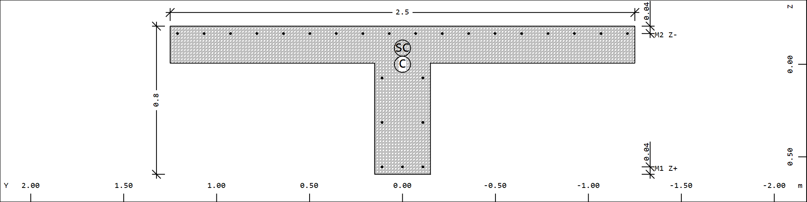
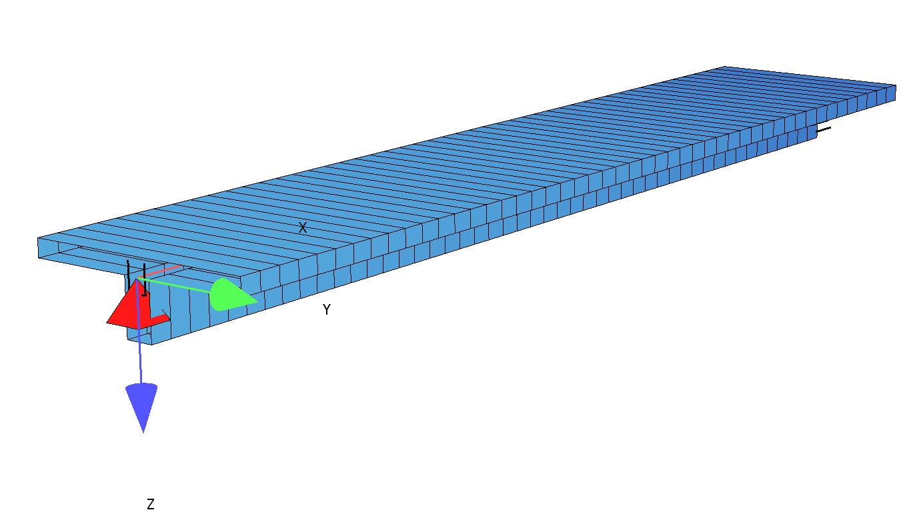

# General

In this example a single span beam will be calculated, performing the following calculations:
- design of the bending reinforcement based on the semi-probabilistic model acc. EN 1990 using partial safety factors
- determining the realiability index $\beta$ and probabilitiy of failure Pf using finite element analysis in Sofistik
- determining the reliability index $\beta$ and probability of failure Pf using a python code

The required reliability index / probability of failure acc. EN 1990 is:
CC2 - 50 years: $\beta$  $\geq$  3,8 ; Pf $\leq$ 7,2 x 10-5
CC3 - 100 years: $\beta$  $\geq$  4,3 ; Pf $\leq$ 8,5 x 10-6
# Model 

Span: 12 m

Cross section of the T-Beam:

Finite Element Model:

# Beam Design acc. EN 1990/1991/1992 with partial safety factors

## SOFiSTiK File

The SOFiSTiK File can be downloaded here:
[03_Example-1_Design_partial_safety_factors](https://github.com/AIztok/Modelling-Analysis_Structural_Concrete/blob/main/SOFiSTiK_Files/03_FROM/03_Example-1_Design_partial_safety_factors.dat)

## Material 
Concrete: C30/37
Reinforcement steel: B 550B

## Actions
Only the dead load of the beam is considered:
- cross section area: 0,68 m2
- dead load: 17 kN/m

## Applied partial safety factors
- Partial safety factor for dead load: 1,35
- Material safety factor for concrete: 1,50
- Material safety factor for steel: 1,15

## Required bending reinforcement 

Based on the determined design bending moments the following bending reinforcement was determined:

As,req = 10,72 cm2

# Probabilistic model SOFiSTiK

## General

This is a very simplified model where only two input variables are considered stochastic:
- Reinforcement steel
- Dead load - material weight

The values are based on the JCSS probabilistic model code:
https://www.jcss-lc.org/jcss-probabilistic-model-code/

## SOFiSTiK File

The SOFiSTiK File of the FORM Method can be downloaded here:
[03_Example-1_FORM.dat](https://github.com/AIztok/Modelling-Analysis_Structural_Concrete/blob/main/SOFiSTiK_Files/03_FROM/03_Example-1_FORM.dat)

To perform the analysis also the calculation file is required and should be saved in the same folder:
[03_Example-1_FORM_Model.fem](https://github.com/AIztok/Modelling-Analysis_Structural_Concrete/blob/main/SOFiSTiK_Files/03_FROM/03_Example-1_FORM_Model.fem)
## Reinforcement steel

Mean value of reinforcement steel:
$\mu$  =  550 MPa + 2 x 30 MPa = 610 MPa

Standard deviation:
$\sigma$ = 30 MPa
## Dead load

We consider only the weight, not the dimensions of the element.

Coeficient of variance (C.o.V.): 0.04
Standard deviation = Mean x C.o.V. 

Mean value as factor of dead load:
$\mu$  =  1

Standard deviation as factor of dead load:
$\sigma$ = 0,04

## Results

For a provided reinforcement of 10,7 cm2 the following results were obtained:

- Reliability Index $\beta$: 6,8, 
- Probability of Failure: 5,4E-12

The reliability index is larger as required (3,800 for 50 years or 4,300 for 100 years).

# Python Code 

## Code

Dateien gehostet auf Google Colab können immer eingesehen werden. Berechnen funktioniert nur wenn auf Google Account eingeloggt:

[Jupyter Notebook](https://colab.research.google.com/drive/1_lKY5DuN-rlrEP4K98_0-QDRjW0dsHAn?usp=sharing)

## Results

For a provided reinforcement of 10,7 cm2 the following results were obtained:

Reliability Index $\beta$: 6,305, 
Probability of Failure: 1,442E-10

In order to achieve a reliability index of $\beta$: 3,8 the provided bending reinforcement could be reduced to 8,9 cm2. Or in case of $\beta$: 4,3 to 9,3 cm2.

