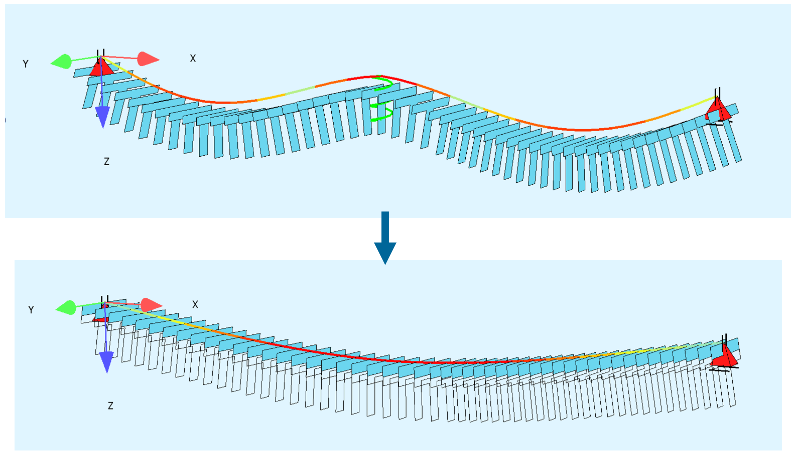

# General

Prefabricated T-Beam placed on 3 support (2 spans), where the middle support is only temporary and will be removed after the in-situ concrete slab is casted and sufficient strength is achieved.

## SOFiSTiK File

The SOFiSTiK File can be downloaded here:
[04_Beam Construction Stages](https://github.com/AIztok/Modelling-Analysis_Structural_Concrete/blob/main/SOFiSTiK_Files/04_Constr_Stages/Beam_Construction_Stages.dat)

