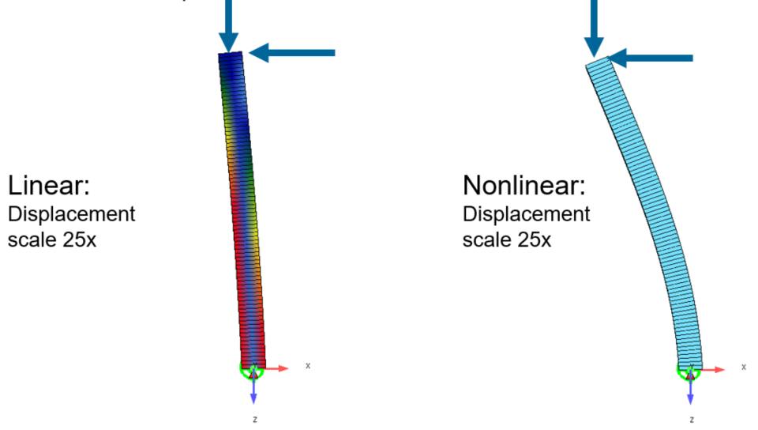

# General

In this example a bridge pier subjected to vertical and horizontal force will be analysed (calculation of internal forces and displacements) using following approaches:
- linear analysis
- geometrically non-linear analysis using theory of 2nd order
- geometrically non-linear analysis using theory of 2nd order and applying an imperfection (H/200)
- geometrically non-linear analysis using theory of 2nd order and material nonlinearity (stress-strain curve for concrete and reinforcement steel with mean values divided with safety factor)
- geometrically non-linear analysis using theory of 2nd order, applying an imperfection (H/200) and material nonlinearity (stress-strain curve for concrete and reinforcement steel with mean values divided with safety factor)

The purpose of the example is to show the magnitude of considering the geometric and material nonlinearity when analysing high piers.

## SOFiSTiK File

The SOFiSTiK File can be downloaded here:
[Pier_nonlinear](https://github.com/AIztok/Modelling-Analysis_Structural_Concrete/blob/main/SOFiSTiK_Files/06_Nonlinear/Pier_nonlinear.dat)

## What does the Software do?

### 2nd order theory
In the 2nd Order Theory calculation the load is applied by the software incrementally in multiple steps and the horizontal displacement of the of the step is considered in the next step, so the next incremental load is applied on a deformed structure resulting in additional bending moments and displacements. Also the decrease of the compressed finite elements is considered (geometric stiffness).

### Imperfections
In the example tow possible ways of applying imperfections are shown:
- SOFILOAD: beam has an imperfection applied on the both ends (bottom end = 0; top end = H/200). 
- ASE: the imperfection is applied by moving the nodes by the factor 1/200 x Z-value of the node

When applying with Sofiload the imperfection is considered in the calculation (if the imperfection load case applied in the calculation), however in the results (displacement) the part of the imperfection is not shown. However, in ASE the imperfection is shown.

### Material nonlinearity
The material nonlinearity is considered by performing in between the incrementally applied load steps not only the a calculation of internal forces and displacement of the system but also a calculation of the stresses and curvatures on the single cross sections due to those internal forces. The strains and curvatures of the cross sections and in the next step considered in the displacement of the system, therefore further increasing the displacements and internal forces. 
In the example a stress-strain curve with mean material values for concrete and reinforcement steel with a safety factor applied, are considered. The tension strenght of the concrete is set to zero.